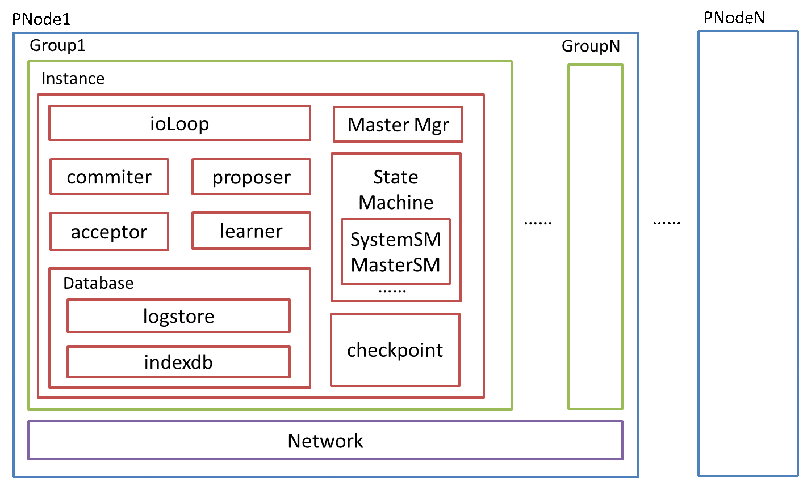
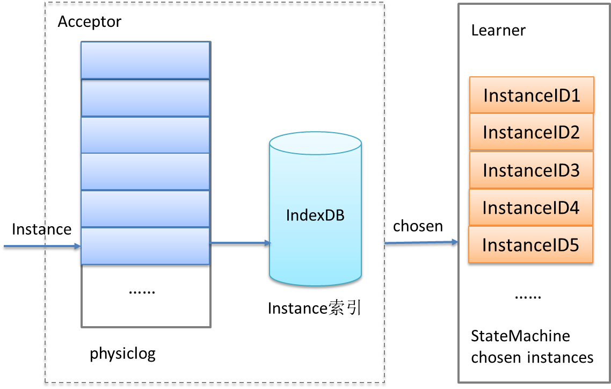
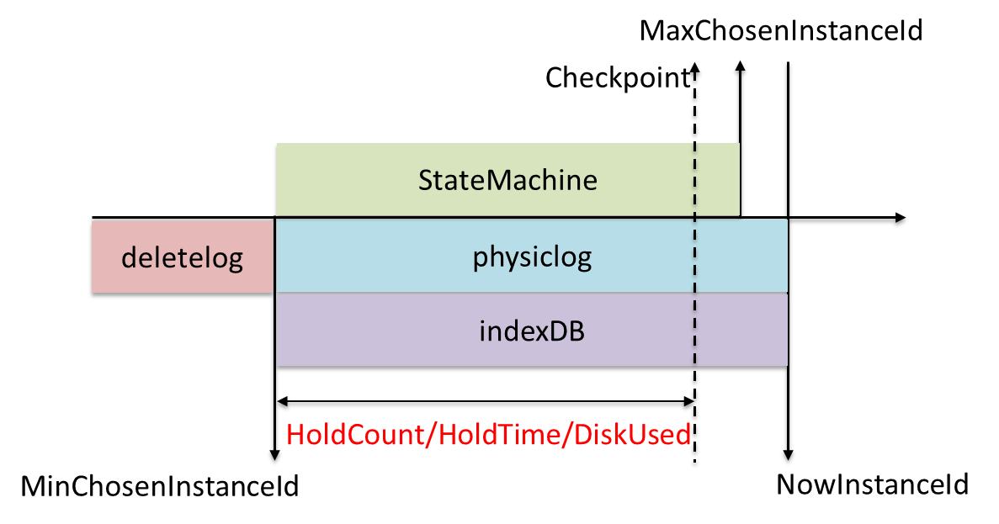

# WPaxos项目结构

## PNode

WPaxos服务集群包括多个独立运行的Node物理节点，每个Node节点有固定数量的Paxos Group，每个group下运行一个Paxos实例，多个Paxos Group可以同时确定多组instanceID递增的有序序列，Paxos实例每确定一个值并提交至状态机执行成功，则instanceID增加1，一旦一个instanceID对应的值被确定，之后不会被修改。
## Logstorage
存储模块业务可自定义实现。为了保证任何情况下已提交的instance数据不丢，Node节点日志存储PaxosLog需要实时持久化存储Acceptor已接受的所有instance数据，并且每条instance数据需支持随机读取。为此，WPaxos默认PaxosLog存储由物理文件和IndexDB索引两部分构成，如下图所示，IndexDB默认采用LevelDB实现，physiclog采用文件顺序追加写+同步刷盘方式，IndexDB则采用异步刷盘，当进程异常挂掉时，只要保证physiclog数据不丢，即可通过PaxosLog重放，恢复IndexDB中的索引数。  
  
但在实际测试中发现，LevelDB异步写接口时常会发生几百毫秒的存储抖动，为了解决这个问题，在Paxos group数量比较少时，我们将IndexDB实现改为了内存缓存+异步写文件方式，解决了抖动问题，同时便于历史日志以文件为单位批量清理。  
WPaxos同时支持按照instance保留数量（HoldCount）、保留时间（HoldTime）以及磁盘空间占用率三种方式清理PaxosLog历史日志。    

## StateMachine
一个Paxos实例可以挂载多种状态机，其中Master StateMachine与System StateMachine为服务内置状态机，前者用来实现Master选举、续约状态管理，后者用来实现Member Ship成员动态变更管理。用户可以将核心业务逻辑添加到自定义状态机execute方法中执行。一个Paxos实例中任何节点，在执行同一条instance数据的时候，看到的状态机所有数据状态，都是一致的。  
## Checkpoint
Checkpoint为状态机数据快照，状态机可通过execute方法执行实时更新快照，也可在checkpoint replayer中重读数据异步生成，通过快照可恢复状态机数据，但Checkpoint同步是个比较重的过程，需要删除所有历史数据来重构状态机。在Paxos实例中任何节点都可以作为Learner，定时向其它节点询问自己数据是否有落后，若某节点最大instanceID小于一定时间内返回Ack的所有节点最小chosen instanceID，则选择同步checkpoint来对齐数据。  
## Network
同样，网络通信模块用户也可自定义。WPaxos默认实现中，可指定创建多少组网络IO实例，每组实例中会初始化一个本节点与Paxos实例中其它所有节点的TCP连接以及UDPClient。在一个Paxos实例中，来自同一个节点的所有请求都是串行的，因此默认初始化IO实例数为Paxos Group数量，即可满足性能最大化需求。  
